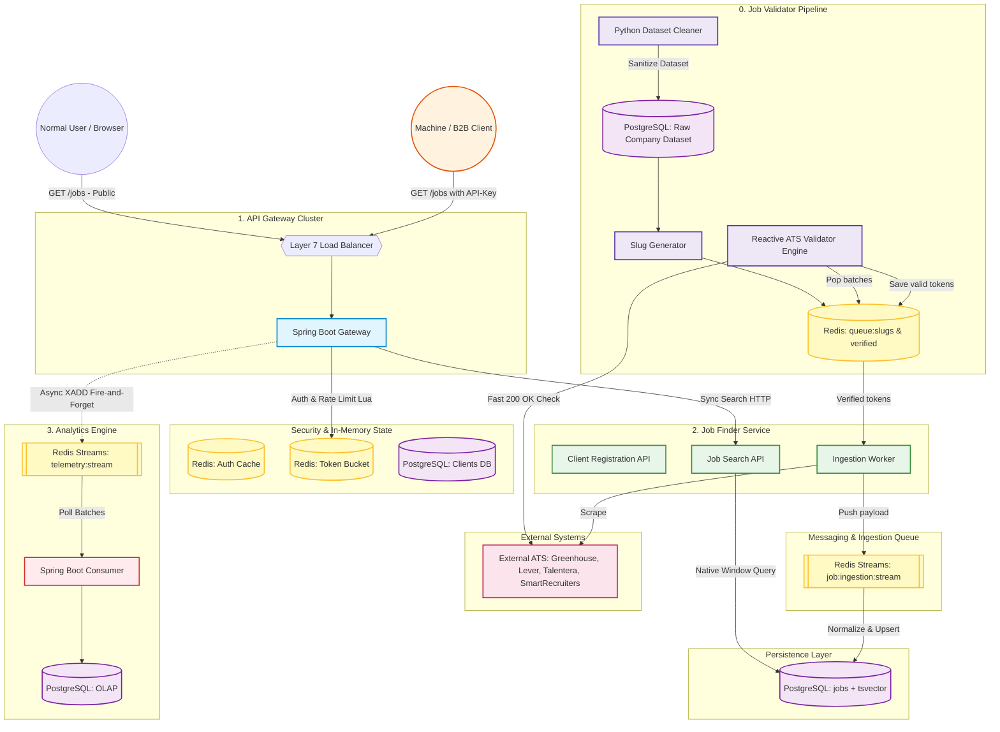

# Unified Global Job Aggregator (Distributed System)


An enterprise-scale, event-driven microservices architecture designed to autonomously discover, validate, scrape, and aggregate job listings from global ATS platforms (Greenhouse, Lever, Talentera, SmartRecruiters) into a high-performance interleaved feed.

## 🏗️ System Architecture

The platform operates across 5 decoupled services utilizing asynchronous messaging (Redis Streams), dual-tier rate limiting, and an Extract, Load, Transform (ELT) data pipeline.



---

## ⚙️ Core Microservices

### 1. The Secure Entrypoint (`api-gateway`)
* **Framework:** Spring Cloud Gateway
* **Security:** Hashed API key authentication and a custom pre-filter pipeline.
* **Traffic Control:** Dual-tier rate limiting using Redis Lua scripts (IP-based limits for public users, Token Bucket tiers for authenticated B2B machines).
* **Observability:** Emits strict zero-latency telemetry to Redis Streams (`XADD`) on every request.

### 2. Autonomous Reconnaissance (`job-validator`)
* **Discovery Engine:** Dynamically generates slug variations from raw company datasets and queues them via Redis.
* **Reactive Validation:** Uses a high-concurrency Spring WebFlux engine to perform fast HTTP probing on external ATS boards. Only targets returning `200 OK` are advanced.
* **Dataset Sanitization:** A dedicated Python worker scrubs dead links from the database to ensure processing efficiency.

### 3. The Core Business & ELT Hub (`job-finder`)
* **Ingestion Pipeline:** Non-blocking scrapers poll verified endpoints. Raw job payloads are published to `job:ingestion:stream`.
* **Transformation:** A dedicated consumer polls the stream, standardizes data via a custom 110+ country Location Normalizer, deduplicates, and upserts to PostgreSQL using strict Universal UUIDs.
* **Interleaved Feed:** The Search API bypasses standard ORM querying, executing native PostgreSQL window functions (`ROW_NUMBER() OVER PARTITION BY company_id`) to prevent high-volume enterprise companies from dominating search results. Full-text search leverages `tsvector`.

### 4. Observability Engine (`analytics-engine`)
* **Asynchronous Telemetry:** Consumes batched gateway telemetry from Redis Streams without blocking standard user traffic. 
* **Storage:** Aggregates metrics into an OLAP PostgreSQL schema to power the frontend health monitoring dashboards.

### 5. Frontend Dashboard (`react-ui`)
* **UI/UX:** A tailored, responsive React application.
* **Features:** Master-detail split-pane architecture for fast browsing, instant location/department filtering, and live system metrics monitoring API health and ingestion volumes.

---

## 🚀 Getting Started

### Prerequisites
* Docker & Docker Compose
* Java 17+
* Node.js & npm

### Running Locally
1. Clone the repository:
   ```bash
   git clone [https://github.com/hasanmahdi2007/my-distributed-system.git](https://github.com/hasanmahdi2007/my-distributed-system.git)
   cd my-distributed-system
   ```
2. Create a `.env` file in the root directory (do not commit this file) with your required database credentials:
   ```env
   POSTGRES_USER=postgres
   POSTGRES_PASSWORD=your_secure_password
   ```
3. Boot the infrastructure (PostgreSQL, Redis) and the microservices via Docker Compose:
   ```bash
   docker compose up -d
   ```

---

## 🗺️ Roadmap & Learnings

Building this 5-service architecture was a massive undertaking focused on enterprise scalability. Key software engineering (SWE) principles applied include strictly enforced **Separation of Concerns (SOC)**, robust domain-driven packaging, and fully decoupled event-driven messaging. 

**Next Steps:**
- [ ] Migrate infrastructure and deploy to AWS (ECS, RDS, ElastiCache).
- [ ] Implement CI/CD pipelines via GitHub Actions.
- [ ] Introduce Elasticsearch for advanced fuzzy matching.

---
*Developed by Hasan Mahdi.*